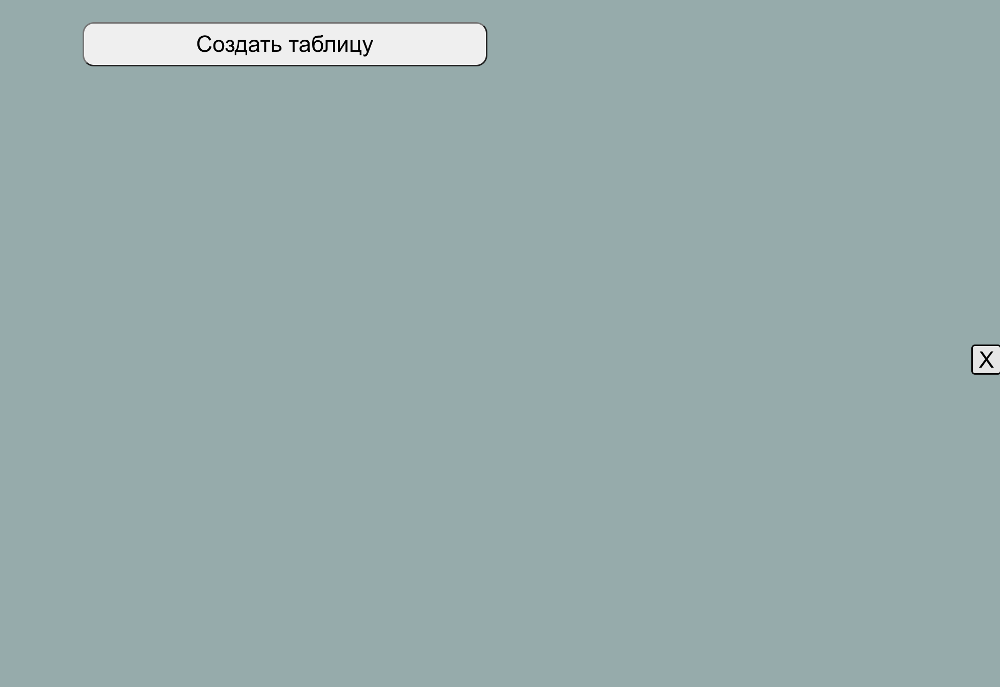
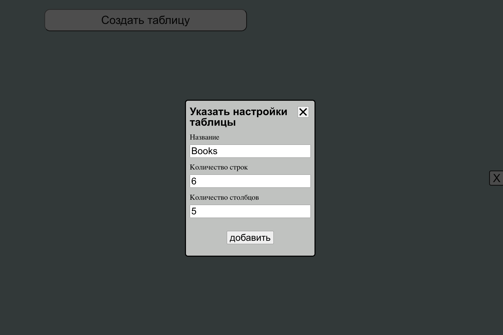
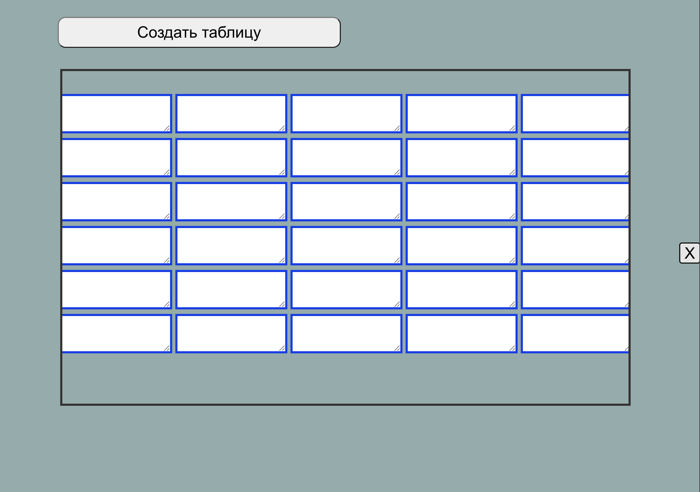
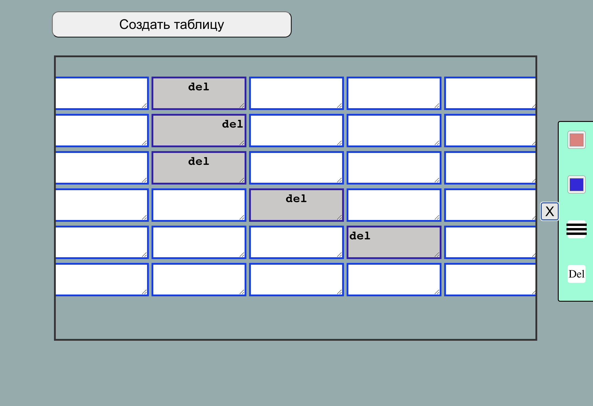
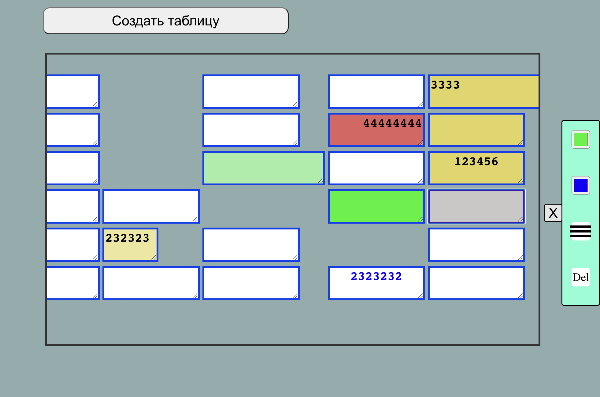

# Excel Table
Для запуска в браузере необходимо:

Открыть терминал

Необходимо скачать зависимости командой
- npm install

Запустить командой 
- npm start

Проект можно посмотреть по ссылке https://igorgap.github.io/Excel-Table/

Можно создать таблицу любого размера. Например создаем таблицу Books размером 6 на 5 ячеек. 

В фиксированном окне отображается таблица, ширину ячеек мы можем по необходимости

Яйчейки возможно выбрать сразу несколько, а можно и одну. Справа есть панель управления таблицы. 

Можно изменить цвет ячейки, цвет шрифта, разместить текст по разным сторонам ячейки, а можем удалить выбранные элементы таблицы

